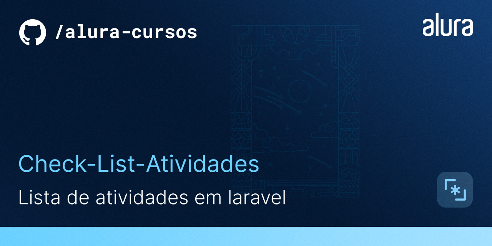

# Orgs
<hr>

Lista de atividades com autenticação, desenvolvido para testar conhecimentos obtidos nas aulas do curso de laravel da Alura.

## 🔨 Funcionalidades do projeto
<hr>

O projeto apresenta de início uma tela de login, permitindo realizar cadastros de usuário também, após autenticar é possível adicionar novas atividades, e marcadas como concluídas, como também remover essa atividade da lista.


## ✔️ Técnicas e tecnologias utilizadas
<hr>

As técnicas e tecnologias utilizadas pra isso são:

- `Mobile first`: Criação de projetos web e sites primeiro em dispositivos móveis
- `ConstraintLayout`: ViewGroup padrão para implementar todos os layouts
- `Roting`: Criação de rotas padronizadas para navegação e realização de requisições
- `Consultas com Eloquent`: Inclui métodos convenientes para fazer essas conversões, bem como controlar quais atributos estão incluídos na representação serializada de seus modelos.
- `Blade Templates`: Criação de templates reutilizaveis que não restringem o uso de codigo php
- `Middleware Authenticate`:  Mecanismo conveniente para inspecionar e filtrar solicitações HTTP utilizado para filtrar usuarios autenticados.
- `Bootstrap`:   Framework web com código-fonte aberto para desenvolvimento de componentes de interface e front-end para sites e aplicações web.


## 🎯 Desafio
<hr>


Tela de detalhes do produto


## 📁 Acesso ao projeto
<hr>

Você pode [acessar o código fonte do projeto inicial](https://github.com/Joseulisses065/Portifolio-HTML-e-CSS-Curso-alura)

## 🛠️ Abrir e rodar o projeto

<hr>

**Versão Laravel utilizada: 5.6.39.**

Para criar as tabelas no bando de dados:
```
php artisan migrate
```

Para iniciar o servidor:
```
php artisan serve
```

No link abaixo você pode acessar meu portfólio:

[Acessar portfólio](https://portifolio-silk-chi.vercel.app/curriculo.html)